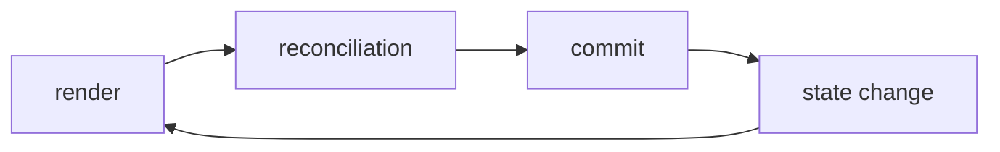
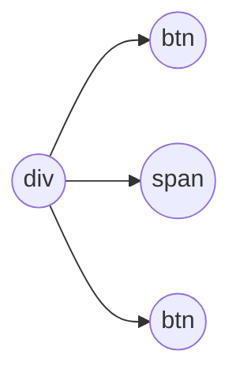

```mermaid

graph LR;
    render-->reconciliation;
    reconciliation-->commit;
    commit-->state[state change];
    state[state change]-->render;


```

```mermaid
flowchart LR
    id1((div))
    id2((btn))
    id3((span))
    id4((btn))

    id1-->id2
    id1-->id3
    id1-->id4

```